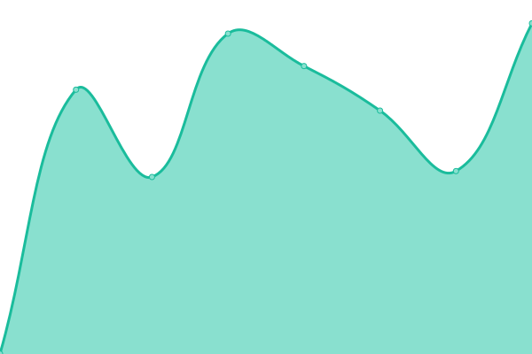
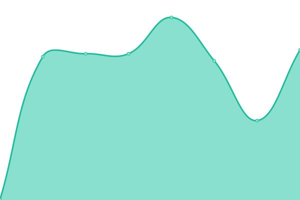
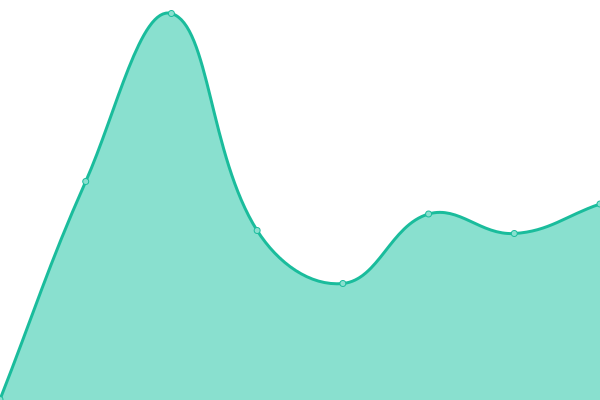
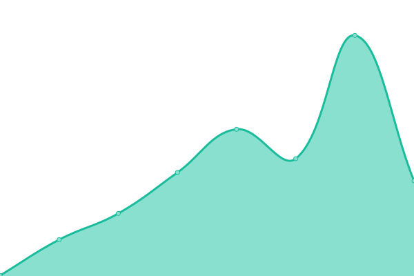

# [📈 Live Status](https://camp-genie.github.io/monitoring): <!--live status--> **🟩 All systems operational**

This repository contains the open-source uptime monitor and status page for [camp-genie](https://camp-genie.github.io/monitoring), powered by [Upptime](https://github.com/upptime/upptime).

With [Upptime](https://upptime.js.org), you can get your own unlimited and free uptime monitor and status page, powered entirely by a GitHub repository. We use [Issues](https://github.com/camp-genie/monitoring/issues) as incident reports, [Actions](https://github.com/camp-genie/monitoring/actions) as uptime monitors, and [Pages](https://camp-genie.github.io/monitoring) for the status page.

<!--start: status pages-->
<!-- This summary is generated by Upptime (https://github.com/upptime/upptime) -->
<!-- Do not edit this manually, your changes will be overwritten -->
<!-- prettier-ignore -->
| URL | Status | History | Response Time | Uptime |
| --- | ------ | ------- | ------------- | ------ |
|  [Camp Genie Web - Live](https://app.thisiscampgenie.com/api/health/live) | 🟩 Up | [camp-genie-web-live.yml](https://github.com/camp-genie/monitoring/commits/HEAD/history/camp-genie-web-live.yml) | 

 391ms
     
 | 

<a href="https://camp-genie.github.io/monitoring/history/camp-genie-web-live">100.00%</a>
    

|  [Camp Genie Web - Ready](https://app.thisiscampgenie.com/api/health/ready) | 🟩 Up | [camp-genie-web-ready.yml](https://github.com/camp-genie/monitoring/commits/HEAD/history/camp-genie-web-ready.yml) | 

 463ms
     
 | 

<a href="https://camp-genie.github.io/monitoring/history/camp-genie-web-ready">100.00%</a>
    

|  [Camp Genie Web - Monitoring Admin Portal](https://app.thisiscampgenie.com/api/monitoring/admin-portal) | 🟩 Up | [camp-genie-web-monitoring-admin-portal.yml](https://github.com/camp-genie/monitoring/commits/HEAD/history/camp-genie-web-monitoring-admin-portal.yml) | 

 449ms
     
 | 

<a href="https://camp-genie.github.io/monitoring/history/camp-genie-web-monitoring-admin-portal">100.00%</a>
    

|  [Camp Genie Web - Monitoring Bookings](https://app.thisiscampgenie.com/api/monitoring/bookings) | 🟩 Up | [camp-genie-web-monitoring-bookings.yml](https://github.com/camp-genie/monitoring/commits/HEAD/history/camp-genie-web-monitoring-bookings.yml) | 

 337ms
     
 | 

<a href="https://camp-genie.github.io/monitoring/history/camp-genie-web-monitoring-bookings">100.00%</a>
    

|  [Camp Genie Web - Monitoring Stripe Webhooks](https://app.thisiscampgenie.com/api/monitoring/stripe-webhooks) | 🟩 Up | [camp-genie-web-monitoring-stripe-webhooks.yml](https://github.com/camp-genie/monitoring/commits/HEAD/history/camp-genie-web-monitoring-stripe-webhooks.yml) | 

 244ms
     
 | 

<a href="https://camp-genie.github.io/monitoring/history/camp-genie-web-monitoring-stripe-webhooks">100.00%</a>
    

|  [Camp Genie Admin - Health](https://admin.thisiscampgenie.com/healthz.json) | 🟩 Up | [camp-genie-admin-health.yml](https://github.com/camp-genie/monitoring/commits/HEAD/history/camp-genie-admin-health.yml) | 

 263ms
     
 | 

<a href="https://camp-genie.github.io/monitoring/history/camp-genie-admin-health">100.00%</a>
    

<!--end: status pages-->

[**Visit our status website →**](https://camp-genie.github.io/monitoring)

## 📄 License

- Powered by: [Upptime](https://github.com/upptime/upptime)
- Code: [MIT](./LICENSE) © [Anand Chowdhary](https://anandchowdhary.com), supported by [Pabio](https://pabio.com)
- Data in the `./history` directory: [Open Database License](https://opendatacommons.org/licenses/odbl/1-0/)
